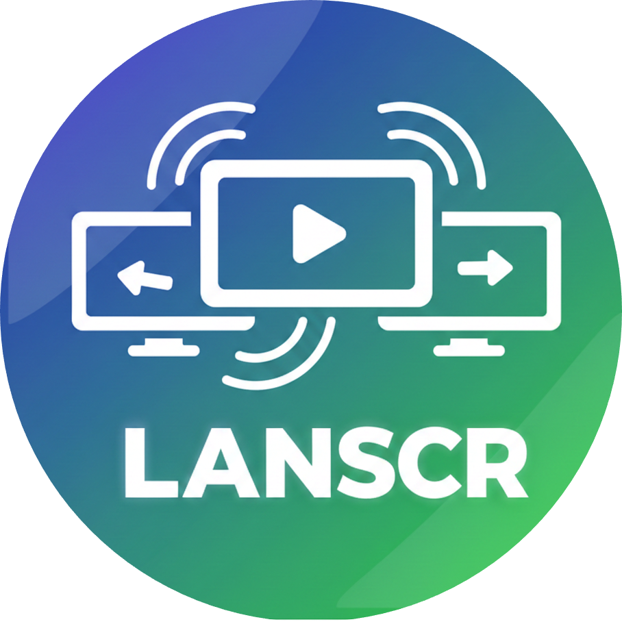

<p align="center">
  
</p>

<h1 align="center">LANSCR</h1>
<p align="center">Lightweight Windows LAN Screen Sharing</p>

<p align="center">
  <a href="#quick-start-end-users">Quick Start</a> •
  <a href="#demo--screenshots">Demo & Screenshots</a> •
  <a href="#features-high-level">Features</a> •
  <a href="#build-from-source-developers">Build Guide</a> •
  <a href="https://github.com/pidugulikhil/LANSCR/releases">Download</a>
</p>

---

LANSCR is a lightweight Windows app for **live screen sharing over LAN / Wi-Fi**.

It can stream:
- Screen video as **MJPEG over HTTP**
- System audio as **WAV (PCM16) over HTTP** (optional)

The full software is implemented in one C++ file: `lanscr.cpp`.

---

## Quick start (end users)

1. Download the latest build from GitHub **Releases**.
2. Extract the ZIP.
3. Run:
   - Double-click `LANSCR.exe` (opens the GUI launcher), or
   - Start a server from a terminal: `LANSCR.exe server 8000`

You do **not** need Visual Studio to run the prebuilt EXE.

---

## Demo & screenshots

### 📹 Demo video

Watch LANSCR in action (auto-playing):

<p align="center">
  
</p>

> **💡 To create the demo GIF:** Run this command (requires [FFmpeg](https://ffmpeg.org/download.html)):
> ```bash
> ffmpeg -i docs/demo.mp4 -vf "fps=10,scale=800:-1:flags=lanczos,split[s0][s1];[s0]palettegen=max_colors=128[p];[s1][p]paletteuse=dither=bayer" -loop 0 docs/demo.gif
> ```
> Or use online converters like [CloudConvert](https://cloudconvert.com/mp4-to-gif) to convert `docs/demo.mp4` → `docs/demo.gif`

The demo shows:
- ✅ Starting the server from the GUI launcher
- ✅ Opening the browser viewer on another device
- ✅ Using the native Windows client viewer
- ✅ Audio streaming and mute controls

<details>
<summary><strong>📥 Prefer MP4 download?</strong></summary>

If the GIF quality isn't sufficient, download the full-quality MP4 video: [docs/demo.mp4](https://github.com/pidugulikhil/LANSCR/raw/main/docs/demo.mp4)

</details>

### 🖼️ GUI screenshots

#### Main launcher window

<p align="center">
  
</p>

*The GUI launcher lets you start/stop servers, open viewers, and detect running servers — all without touching the command line.*

**Key features shown:**
- 🎛️ Server controls: Port, FPS, Quality settings
- 🔊 Audio controls: Mute server audio toggle
- 🔒 Private mode: Optional username/password protection
- 👁️ Client viewer: Quick launch with custom URL
- 🔍 Server detection: Find and stop running servers
- 📝 Live log: Real-time status and command examples

#### Private mode / Authentication setup

<p align="center">
  
</p>

*When you enable "Private mode" in the GUI, this dialog lets you configure HTTP Basic Auth for your stream.*

**Options:**
- **Automatic (recommended)**: Generates random credentials (shown in console)
- **Manual**: Set your own username and password
- **Regenerate**: Create new random credentials instantly

> **🔐 Security note:** Private mode uses HTTP Basic Auth. It's suitable for trusted LANs but not a replacement for encryption (HTTPS).

#### Browser viewer

<p align="center">
  
</p>

*Open `http://<server-ip>:<port>/` in any browser to view the live screen + audio stream.*

#### Native Windows client

<p align="center">
  
</p>

*The built-in native viewer provides a lightweight alternative to browser viewing.*

---

> **📸 To add missing screenshots:** Save your screenshots as `browser-viewer.png` and `native-client.png` in the `docs/` folder. The GUI screenshots (`gui-launcher.png` and `gui-private-mode.png`) should already be there.

---

## What does it do?

LANSCR can run in multiple modes:

- **Server mode**: captures your screen and streams it over HTTP as **MJPEG**, and streams system audio as **WAV (PCM16)**.
- **Client mode**: connects to a server URL, displays the MJPEG stream in a native window, and plays the WAV audio.
- **Browser viewer**: when you open the server URL in a browser, the server serves a simple landing page that shows the video (`/mjpeg`) and audio (`/audio`).
- **GUI launcher**: when you double‑click `LANSCR.exe` with no arguments, it shows a small Win32 UI to start/stop server and open viewer links.
- **Extra commands**: mute server audio (`/control?mute=1`), stop a local server by port, and “detect” running servers on any port.

---

## Features (high level)

- Live screen streaming over HTTP MJPEG (`/mjpeg`) with a browser landing page (`/`)
- Live system-audio streaming over HTTP WAV (`/audio`) using WASAPI loopback
- Native Windows client viewer (WinHTTP + WIC + Win32) with local mute
- Server-side mute control endpoint (`/control?mute=0|1`) returning JSON status
- GUI launcher (double-click) to start/stop server, open browser, open viewer, and manage mute
- Detect running servers and stop selected/all (CLI and GUI)
- Optional UDP video-only mode for low-latency experiments (`udp-server` / `udp-client`)

---

## Features & overview (detailed)

This section is the complete feature write-up (from `features.txt`), included here so GitHub readers see everything in one place.

### What is LANSCR?

LANSCR is a lightweight Windows app for **LIVE screen sharing** over a local network (LAN / Wi‑Fi).
It is mainly built to quickly share your screen (and optionally system audio) to another device on the same network without installing heavy remote-desktop software.

It is implemented as a single-file C++ program (`lanscr.cpp`) that can run as:
- a streaming **SERVER** (captures screen + audio)
- a native **CLIENT** viewer (shows video and plays audio)
- a browser-viewer server (simple HTML landing page)
- a small GUI **LAUNCHER** when double-clicked

### Core abilities (what it can do)

#### 1) Live screen streaming (HTTP MJPEG)
- Captures the entire virtual desktop (multi-monitor aware).
- Encodes frames to JPEG.
- Streams as MJPEG over HTTP using multipart boundaries.
- Endpoint: `/mjpeg` (default stream)

#### 2) Live system audio streaming (HTTP WAV)
- Captures system output using WASAPI loopback (default render device).
- Converts to PCM16 and streams it as a WAV stream.
- Endpoint: `/audio`

#### 3) Built-in landing page (browser viewer)
- Visiting the server root URL (`/`) returns an HTML page that:
  - displays the MJPEG stream
  - includes an audio element pointing to `/audio`
  - provides an “Enable Audio” click because browsers often block autoplay audio

#### 4) Native client viewer (WinHTTP + WIC + Win32)
- Connects to a server URL.
- Fetches MJPEG via WinHTTP, decodes JPEG frames using WIC, and displays them in a Win32 window.
- Fetches audio (`/audio`) and plays PCM16 using WinMM `waveOut` APIs.
- Supports client-side mute.

#### 5) Server audio mute control (HTTP control endpoint)
- Endpoint: `/control?mute=0|1`
- Toggles server-side audio mute.
- Returns status JSON: `{ "audioMuted": true/false }`

#### 6) Start/Stop server safely (multi-instance aware)
- When a server starts, it creates a named stop event per port.
- Another process (or GUI) can stop it by setting the event.
- CLI command: `stop <port>`

#### 7) Detect running servers quickly
- Scans ports and checks for server stop-events (works even on uncommon ports).
- CLI command: `detect`
- GUI button: Detect (shows ports that appear to have a server running)

#### 8) UDP mode (low-latency video-only streaming)
- UDP server sends JPEG frames split into small chunks (~1200 bytes payload) for better LAN delivery.
- UDP client periodically sends a “hello/subscribe” packet to the server.
- UDP server keeps a live client list (clients expire after ~3 seconds without hello).
- NOTE: UDP mode is video-only (no audio in UDP mode).

### Modes / commands (CLI)

Run `LANSCR.exe --help` for the full list. Key commands:

#### 1) HTTP server (screen + audio)
- `LANSCR.exe server <port> [fps] [jpegQuality0to100]`
  - Example: `LANSCR.exe server 8000 10 92`

#### 2) HTTP client (native viewer)
- `LANSCR.exe client <url>`
  - Example: `LANSCR.exe client http://192.168.1.50:8000/`

#### 3) Client mute
- `LANSCR.exe --mute client <url>`
  - (mutes local playback only)

#### 4) Server mute / disable audio
- `LANSCR.exe --mute-audio server <port> ...` (starts server muted)
- `LANSCR.exe --no-audio server <port> ...` (disables audio endpoint)

#### 5) Control mute for an existing server
- `LANSCR.exe audio-mute <urlOrPort> <0|1>`
  - Examples:
    - `LANSCR.exe audio-mute 8000 1`
    - `LANSCR.exe audio-mute http://192.168.1.50:8000 0`

#### 6) Stop server
- `LANSCR.exe stop <port>`

#### 7) Detect servers
- `LANSCR.exe detect`

#### 8) UDP mode (video-only)
- `LANSCR.exe udp-server <port> [fps] [jpegQuality0to100]`
- `LANSCR.exe udp-client <serverIp> <port>`

### GUI launcher features (double-click behavior)

If you double-click `LANSCR.exe` with no CLI arguments, it opens a launcher UI:

**Server section**
- Port / FPS / Quality fields
- Start Server, Stop, Open Browser
- “Mute server audio” checkbox (also sends `/control?mute=...` to external server on the same port)

**Client section**
- URL field (default: `http://127.0.0.1:8000/`)
- Open Client Viewer (launches a new instance in client mode)
- “Mute client audio” checkbox (applies to newly launched viewer instances)

**Server detection section**
- Detect running servers (fast scan)
- Listbox of detected ports
- Stop Selected / Stop All

**Logging**
- A log box shows status messages and actions.

### Performance & behavior notes

- Demand-driven capture: the HTTP server capture loop avoids capturing when no clients are connected (reduces CPU usage).
- Lower latency streaming: non-blocking sockets + bounded send; slow clients are dropped rather than buffering seconds of delay.
- Multi-monitor aware: captures the virtual screen rectangle.
- DPI awareness: viewer/launcher attempt per-monitor DPI awareness for crisp UI.

### Use cases

- Share your PC screen to your phone/tablet on the same Wi‑Fi.
- Present locally in a classroom/meeting where devices are on the same LAN.
- Quick “second screen” preview on another Windows machine.
- Troubleshooting: run server on a PC, open the stream in a browser on another device.
- Low-latency experiments: UDP mode for video-only.

### Limitations / important security notes

- LAN/trusted network only: the HTTP stream has NO authentication by default.
- Not encrypted: unless you run it behind your own secure tunnel, traffic is plain HTTP.
- Anyone who can reach the port can view the stream.
- Audio behavior in browsers: audio often requires a user click (“Enable Audio”).

### What makes the EXE look “professional” (icon/metadata)

- Icon, version fields, and embedded manifest are provided via `lanscr.rc` + `lanscr.manifest` + `lanscr.ico`.
- This affects Explorer “Details” and the app icon.
- It does NOT change Windows “Unknown Publisher” warnings (that requires code signing).

### Suggested workflows

**Easiest end-user usage**
1. Download `LANSCR.exe` from GitHub Releases.
2. Run it (GUI), or run server command.
3. Open `http://<server-ip>:<port>/` on another device.

**Developer usage**
- Build with `build.bat` / `run.bat` (requires MSVC + Windows SDK).

### Feature checklist (quick)

- [x] HTTP MJPEG screen streaming
- [x] Browser landing page
- [x] HTTP audio streaming (WAV) via WASAPI loopback
- [x] Native client viewer (video + audio)
- [x] Client-side mute
- [x] Server-side mute + control endpoint
- [x] GUI launcher for starting/stopping and quick actions
- [x] Detect running servers
- [x] Stop selected / stop all servers
- [x] UDP video-only streaming mode

## Use cases

- Share your screen to a phone/tablet on the same Wi-Fi
- Local presentations/classrooms where all devices are on the same LAN
- Quick “second screen” preview on another Windows PC
- Troubleshooting: start server on a PC, open the stream from another device on the LAN

---

## Why this app?

- **No dependencies**: built with Windows APIs (WinSock, WinHTTP, WIC, WASAPI, WinMM).
- **Low setup**: one EXE for running.
- **LAN-first**: intended for trusted local networks.

---

## How it works (based on `lanscr.cpp`)

### Screen capture → JPEG
- Captures the **virtual screen** (multi-monitor) using GDI (`BitBlt`).
- Draws the mouse cursor on top (hardware cursor isn’t included in BitBlt).
- Encodes frames to JPEG using Windows Imaging Component (WIC).
- A single capture thread produces frames shared to all clients.

### Video streaming (MJPEG over HTTP)
- The server is a small HTTP server built on WinSock.
- Video endpoint:
  - `GET /mjpeg` (also default for unknown paths)
  - Response is `multipart/x-mixed-replace` with boundary `frame`.
- The server uses non-blocking sockets and bounded writes to reduce latency; slow clients get dropped rather than accumulating many seconds of delay.

### Audio streaming (WAV over HTTP)
- Audio endpoint: `GET /audio`
- Captures **system output** using WASAPI loopback (default render device).
- Streams a WAV header followed by continuous PCM16 samples.

### Control endpoint (mute)
- `GET /control?mute=0|1` toggles server-side audio mute.
- Returns JSON status: `{ "audioMuted": true/false }`.

### Client viewer (native)
- Fetches MJPEG with WinHTTP, parses JPEG parts, decodes via WIC, and draws frames in a Win32 window.
- Fetches `/audio`, parses the WAV header, then plays PCM via WinMM (`waveOut*`).
- `--mute` (client flag) mutes playback locally without stopping the connection.


---

## Command line usage

Run `LANSCR.exe --help` to see the full list. Common ones:

```text
LANSCR.exe server <port> [fps] [jpegQuality0to100]
LANSCR.exe client <url>
LANSCR.exe udp-server <port> [fps] [jpegQuality0to100]
LANSCR.exe udp-client <serverIp> <port>
LANSCR.exe audio-mute <urlOrPort> <0|1>
LANSCR.exe stop <port>
LANSCR.exe detect
```

Examples:

```text
LANSCR.exe server 8000 10 80
LANSCR.exe client http://192.168.1.50:8000/
LANSCR.exe udp-server 9000 60 70
LANSCR.exe udp-client 192.168.1.50 9000
LANSCR.exe audio-mute 8000 1
LANSCR.exe stop 8000
```

---

## Build from source (developers)

You need MSVC + Windows SDK.

1. Install :
   - Visual Studio 2022 Community → workload: **Desktop development with C++**
   - Visual Studio 2022 Build Tools → **MSVC v143** + **Windows 10/11 SDK**
2. In this folder run:
   - Double-click `Setup.bat' and choose No, that first downloads the Visual Studio then Builds the exe file from that CPP Source file
Notes:
- `run.bat` is a helper and may offer to install Build Tools using winget.
- `build.bat` compiles `lanscr.rc` into `LANSCR.res` and links it into the final EXE.

---

## EXE icon + version metadata + manifest

These files are embedded into `LANSCR.exe` at build time:

- `lanscr.rc`
  - icon resource
  - version info (Explorer → Properties → Details)
  - embeds the manifest (`RT_MANIFEST "lanscr.manifest"`)
- `lanscr.manifest`
- `lanscr.ico`

---

## Security notes (important)

LANSCR is intended for **trusted LAN use**.

- The HTTP stream is not encrypted and has no authentication.
- Anyone on the same network who can reach the port can view the stream.
- Use Windows Firewall/router rules if you need to restrict access.

---

## Troubleshooting

### “Unknown Publisher” / Security warning when running the EXE
This is expected for any **unsigned** EXE downloaded from the internet.

- The **Publisher** shown in the Windows security dialog comes from a **digital signature** (code-signing certificate).
- The metadata in `lanscr.rc` shows up under **Explorer → Properties → Details**, but it does **not** make Windows trust the file.

To remove “Unknown Publisher”, you must **code-sign** the EXE with a trusted certificate.

Tip (downloaded ZIPs): after extracting, right-click `LANSCR.exe` → **Properties** → check **Unblock** (if shown).
Or PowerShell:

```powershell
Unblock-File .\LANSCR.exe
```

### Audio plays only after clicking
Browsers often block autoplay audio. On the web page, click **Enable Audio**.

### Build: “cl.exe not found”
Install MSVC Build Tools/Visual Studio (see “Build from source”).

---

## Repo contents

- `lanscr.cpp` — the full application (server + client + GUI)
- `lanscr.rc` / `lanscr.manifest` / `lanscr.ico` — icon + version metadata + embedded manifest
- `build.bat` / `run.bat` — build helpers
